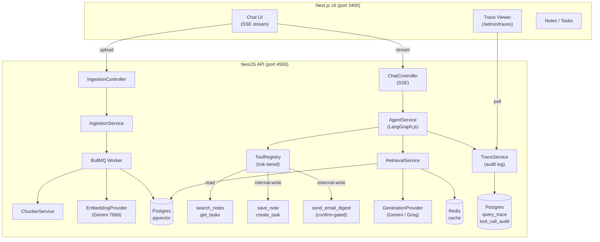

# DocMind

<p align="center">
  <a href="https://github.com/codedsultan/docmind/actions/workflows/ci.yml">
    
  </a>
  <a href="https://codecov.io/gh/codedsultan/docmind">
    
  </a>
  
  
  
  
  <a href="./CHANGELOG.md">
    
  </a>
</p>

An AI assistant that answers questions from your own documents with cited sources, and can take scoped, audited actions on your behalf — save a note, create a task, send yourself an email digest — using a three-tier risk model (read / internal-write / external-write) that mirrors production agentic systems.

Not a "call an LLM API" demo. The interesting parts are the retrieval pipeline, the tool-tier enforcement, and the eval harness in CI.

## Architecture



## Features

### Hybrid Retrieval with Citations
Upload a PDF, Markdown, or plain text file. Every query runs a **parallel vector + keyword search** (pgvector cosine + `tsvector`), fuses results via **Reciprocal Rank Fusion**, applies a similarity floor, and optionally re-ranks before returning. Answers surface the exact chunks used, so citations point to real source text — not plausible-sounding prose.

### Agentic Tool Calling (Three Tiers)
The chat interface connects to a **LangGraph.js StateGraph** agent, not a raw prompt chain. Tools are registered with an explicit `riskTier`:

| Tier | Behavior | Example tools |
|---|---|---|
| `read` | Execute freely | `search_notes`, `get_tasks` |
| `internal_write` | Execute + audit | `save_note`, `create_task` |
| `external_write` | Propose → confirm → execute + audit | `send_email_digest` |

External-write tools surface a confirmation card in the UI before any action is taken. Every tool call (including failures) writes a `ToolCallAudit` row.

### Streaming (SSE)
Responses stream token-by-token via Server-Sent Events — both the initial retrieval-and-generate path and the agent loop stream intermediate steps as they arrive.

### Observability
A `QueryTrace` row is written for every query, capturing: retrieved chunks, vector/keyword/fused scores, provider name, latency breakdown, and whether a tool was invoked. Visible at `/admin/traces`.

### Retrieval Eval in CI
A hand-labeled 18-case eval set (`backend/eval/retrieval.json`) runs as a **required CI job** (`eval-retrieval`) against a real pgvector container. Exit criteria: hit@5 ≥ 0.75, MRR ≥ 0.60. Pre-computed Gemini embeddings for the fixture document are committed so CI never calls the embedding API.

## Feature Walkthrough

**1. Upload a document**

Drag or select a file → the backend parses it, chunks it (800-char target, 150-char overlap), embeds each chunk with Gemini `gemini-embedding-001` (768 dimensions), and stores chunks with an HNSW-indexed `vector(768)` column. The job runs async via BullMQ so the upload response is immediate.

**2. Ask a question — see citations**

Type any question in the chat. The retrieval pipeline runs in parallel:
- pgvector cosine similarity over the HNSW index
- Postgres `tsvector` / `tsquery` full-text search

Results are fused via RRF (`k=60`) then passed to the generation provider. The response streams in as SSE. Each cited passage links back to its chunk.

**3. Ask the agent to save a note**

> "Save a note: remember that MVCC avoids locking"

The agent loop invokes `save_note` (internal-write). The action executes, an audit row is written, and the note appears in the Notes view.

**4. Ask the agent to send an email digest**

> "Send me an email digest of today's notes"

The agent surfaces a confirmation card (`external_write` gate). Confirm → the digest email is sent and the audit row captures the outcome.

**5. View the trace**

Navigate to `/admin/traces` → open the trace for any query to see: retrieved chunks with individual vector/keyword/fused scores, provider name, total latency, and every tool call with its tier and result.

## Stack

| Technology | Role | Why |
|---|---|---|
| **NestJS** | API framework | Dependency injection and module boundaries keep the service layer clean across five domain modules |
| **Next.js 16 App Router** | Frontend | Server Components by default; SSE consumption isolated in a `useChatStream` hook |
| **Postgres + pgvector** | Storage + vector index | One database, not a separate vector store — HNSW index on `vector(768)` column, hybrid search in raw SQL |
| **Prisma** | ORM | Schema-as-source-of-truth; `$queryRaw` for all vector operations (pgvector extension columns are `Unsupported` in Prisma schema) |
| **BullMQ + Redis** | Async job queue + cache | Ingestion jobs stay out of the request path; query embedding cached in Redis by content hash |
| **LangGraph.js** | Agent orchestration | `StateGraph` makes the tool loop explicit and inspectable, not buried in a library prompt chain |
| **Gemini `gemini-embedding-001`** | Embeddings | Fixed 768d output, committed as the only embedding provider — cross-model re-embedding is not trivial |
| **Gemini / Groq** | Generation | Swappable via `PROVIDER` env var; both implement the same `GenerationProvider` interface |

## Local Development

```bash
# 1. Copy env files
cp backend/.env.example backend/.env
cp frontend/.env.example frontend/.env
# Fill in GEMINI_API_KEY (required for embeddings) and optionally GROQ_API_KEY

# 2. Start the stack
docker compose up --build
```

| Service | URL |
|---|---|
| Frontend | http://localhost:3400 |
| Backend API | http://localhost:4500/api |
| Swagger | http://localhost:4500/docs |
| Health | http://localhost:4500/health |
| Postgres | localhost:5349 |
| Redis | localhost:6399 |

These are non-standard ports chosen to avoid conflicts with other local services. Do not change them — they are consistent across Docker Compose, CI, and all config files.

### Run tests

```bash
pnpm test                  # unit tests (both packages)
pnpm --filter docmind-api test:integration  # integration test (requires Docker)
pnpm eval                  # retrieval eval against real DB (requires Docker + GEMINI_API_KEY)
```

## How This Scales

The current build is deliberately minimal to prove the patterns work end-to-end. Each piece has a natural scale path:

**Tool registry generation** — the five tools here are hand-registered. A production system generates them from an OpenAPI spec: parse operations → auto-assign risk tiers by HTTP method → produce `ToolDefinition` objects. The `ToolRegistry` interface is already designed to accept this.

**Distributed tracing** — `QueryTrace` and `ToolCallAudit` rows give per-query observability. The natural upgrade is OpenTelemetry: attach a trace ID at the request boundary and propagate it through BullMQ jobs, provider calls, and tool invocations without changing application logic.

**Multi-tenant auth** — every model row carries a real `userId` and the retrieval SQL already scopes by it. Phase 5 swaps the hardcoded `DEV_USER_ID` constant for a JWT guard — one change point, nothing else moves.

**Embedding fallback** — generation fallback between Gemini and Groq is straightforward because both models produce text to the same interface. Embedding fallback is intentionally omitted: Gemini and Groq use different embedding spaces, so a chunk indexed with Gemini embeddings cannot be queried with Groq embeddings without re-embedding the entire corpus. Cross-model embedding strategies (dual-index, re-indexing jobs) are described in the architecture docs but not built for V1.

## CI/CD

Three jobs on every push/PR to `main`/`develop`:

- **`test-backend`** — type-check, lint, unit tests with coverage, build
- **`eval-retrieval`** — (requires `test-backend` to pass) spins up a pgvector container, runs migrations, seeds pre-computed fixture embeddings, runs the 18-case eval, exits non-zero if hit@5 < 0.75 or MRR < 0.60
- **`test-frontend`** — type-check, lint, tests
- **`security`** — `pnpm audit` + Snyk scan

`eval-retrieval` is a required status check on `main` and `develop`. A deliberate retrieval regression (distorted RRF `k`) was used to verify it catches regressions before merge.

---

## Author

**Olusegun Ibraheem** — [@codedsultan](https://github.com/codedsultan)

This project is a public portfolio piece demonstrating agentic RAG with tiered tool enforcement — built as part of my exploration of production-grade AI systems. The architecture, patterns, and code are open for review and discussion; 
